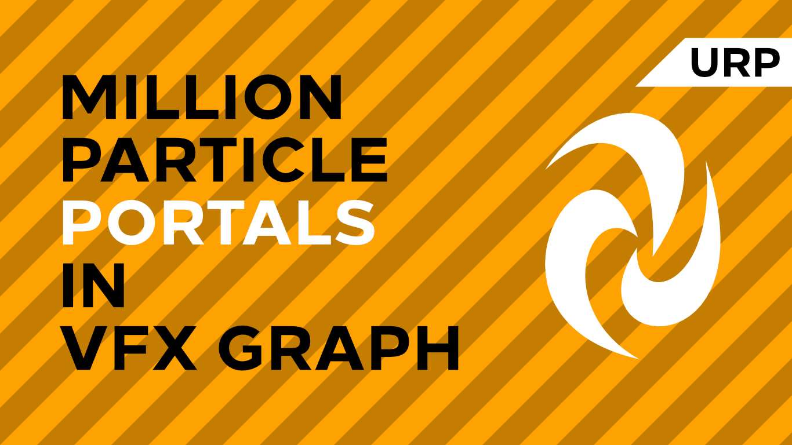

# Million Particle Portals in Visual Effect Graph

A portal visual effect created using Unity's Visual Effect Graph and URP.

## Overview

This project contains a portal visual effect. The portal surface is created using several million particles generated at runtime - the project is intended to show off the power of VFX Graph compared to the old particle system. An accompanying tutorial is available on [danielilett.com](https://danielilett.com/2020-06-14-tut5-8-urp-vfx-portal/).

## Software

This project was created using Unity 2019.4.0f1 (LTS), Visual Effect Graph 7.4.1 and Universal Render Pipeline 7.4.1.

## Authors

This project and the corresponding tutorial series were written by Daniel Ilett. [Follow him on Twitter](https://twitter.com/daniel_ilett) for more gamedev tutorials!

## Release

This project was released on June 13th 2020.
